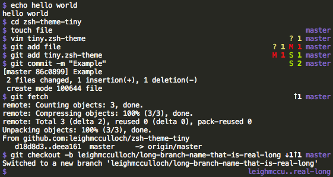

# zsh-theme-tiny

A zsh theme, that takes up a tiny amount of space in the terminal.

## Install (with plain zsh)

1. Download `tiny.zsh-theme`.
2. Put it somewhere. e.g. `~/tiny.zsh-theme`
2. Add to `~/.zshrc`: `source ~/tiny.zsh-theme`.

## Install (with oh-my-zsh)

1. Download `tiny.zsh-theme`.
2. Put it in `~/.oh-my-zsh/custom/themes/`.
3. Edit `~/.zshrc` with `ZSH_THEME="tiny"`.
