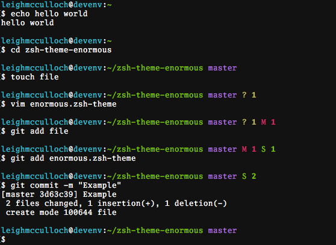

# zsh-theme-enormous

A zsh theme, that takes up an enourmous amount of space in the terminal.

## Install (with plain zsh)

1. Download `enormous.zsh-theme`.
2. Put it somewhere. e.g. `~/enormous.zsh-theme`
2. Add to `~/.zshrc`: `source ~/enormous.zsh-theme`.

## Install (with oh-my-zsh)

1. Download `enormous.zsh-theme`.
2. Put it in `~/.oh-my-zsh/custom/themes/`.
3. Edit `~/.zshrc` with `ZSH_THEME="enormous"`.
